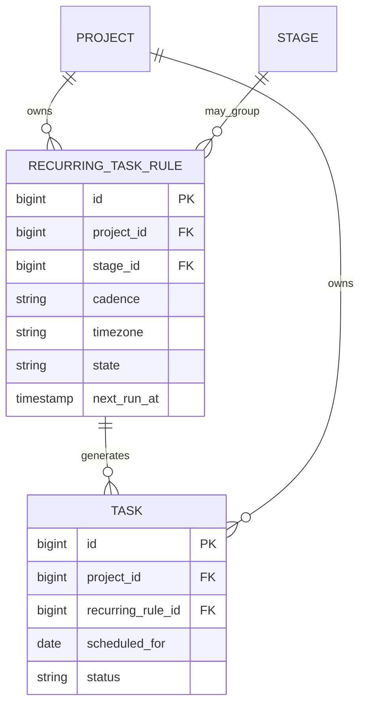
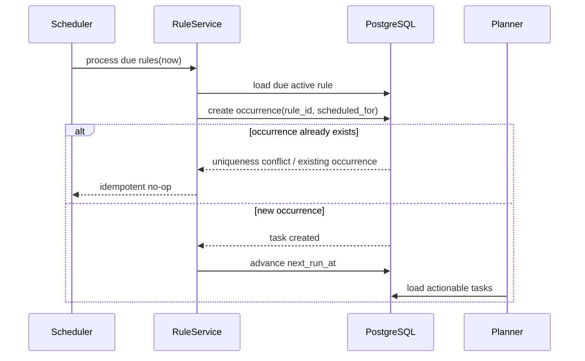
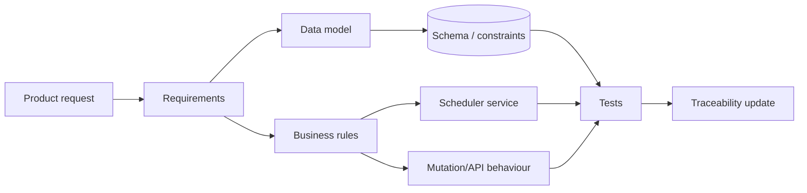

# DevWork — change request analysis example

This artifact shows how a vague product request can be turned into concrete system changes.

## Incoming request

> "I want tasks that repeat automatically, for example every weekday."

That sentence is not yet an implementable requirement. Several behaviours are ambiguous.

## Questions to clarify

1. Which recurrence patterns are needed first: daily, weekdays, weekly, custom days?
2. Is recurrence evaluated in the user's timezone or a project timezone?
3. Does the rule create a new task occurrence or reset the same task?
4. What happens if yesterday's occurrence is still incomplete?
5. Can one occurrence be edited without changing the rule?
6. Can the whole rule be paused without deleting future history?
7. What does "delete recurring task" mean: delete the rule, future occurrences, or historical completed tasks too?
8. Should newly generated occurrences enter the daily planner immediately?
9. Does changing a recurrence rule require confirmation like other mutations?

## Proposed first-version decisions

For a bounded first version:

- support `daily`, `weekdays`, and `weekly` recurrence;
- evaluate recurrence in a stored project timezone;
- create separate task occurrences with stable identities;
- keep completed historical occurrences unchanged;
- allow the recurrence rule to be active/paused;
- rule changes are normal confirmation-gated mutations;
- do not silently create multiple missing occurrences after long downtime without an explicit catch-up policy.

## New functional requirements

### CR-FR-01 — Recurrence rule
The system shall allow a project to store a recurring-task rule containing a task template, cadence and active state.

### CR-FR-02 — Generate occurrence
When a rule is due, the system shall create at most one occurrence for the same rule and scheduled logical date.

### CR-FR-03 — Preserve history
Changing or pausing a recurrence rule shall not mutate already completed historical occurrences.

### CR-FR-04 — Planner integration
A generated actionable occurrence shall participate in the normal daily-planner rules.

### CR-FR-05 — Idempotent generation
Retrying the scheduler for the same rule/date shall not create duplicate task occurrences.

## Data-model impact

New entity:

```text
RecurringTaskRule
- id PK
- project_id FK
- stage_id FK?
- title_template
- cadence: daily | weekdays | weekly
- weekday?
- priority
- default_estimate_minutes?
- timezone
- state: active | paused
- next_run_at
- created_at
- updated_at
```

Task receives optional provenance fields:

```text
Task
- recurring_rule_id FK?
- scheduled_for date?
```

Recommended uniqueness rule for generated occurrences:

```text
UNIQUE(recurring_rule_id, scheduled_for)
```

That database rule supports idempotent scheduler retries.

## ER impact



## API impact

Potential endpoints:

```text
GET    /projects/{project_id}/recurring-task-rules
POST   /actions/proposals              # create/change/pause rule through normal mutation flow
POST   /actions/proposals/{id}/confirm
```

The scheduler itself is an internal application process, not an unauthenticated public endpoint.

## Generation sequence



## Edge cases

### Scheduler retry
The same scheduled date may be processed twice after a timeout. The unique rule/date constraint prevents duplicate logical work.

### Rule edited while occurrence exists
The existing occurrence keeps the values copied at creation time unless product requirements explicitly say otherwise.

### Paused rule
No new occurrences are created while paused. Existing tasks remain normal tasks.

### Missed several days
The first version needs an explicit policy: create only today's occurrence, create all missed occurrences, or ask the user. It must not be left as accidental implementation behaviour.

### Timezone/DST
`next_run_at` should be calculated from an explicit timezone policy rather than server-local time.

## Test impact

| ID | Scenario | Expected result |
|---|---|---|
| CR-TC-01 | Due active rule | one occurrence created |
| CR-TC-02 | Retry same rule/date | no duplicate occurrence |
| CR-TC-03 | Paused rule | no occurrence created |
| CR-TC-04 | Rule edit | completed historical task unchanged |
| CR-TC-05 | Generated todo task | appears in planner if otherwise actionable |
| CR-TC-06 | Duplicate scheduler workers | uniqueness/in-transaction handling preserves one logical occurrence |

## Change-impact map



## Analyst takeaway

The important part is not immediately choosing a cron library. The analyst work is first to remove ambiguity around identity, history, retries, timezone, edits and failure behaviour, then map those decisions to data, interfaces and tests.
