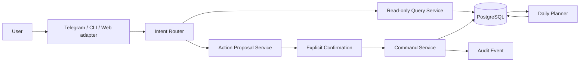
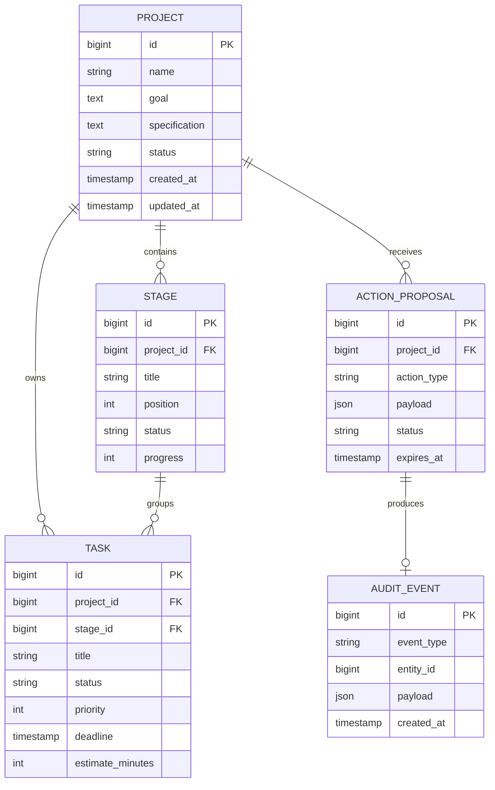
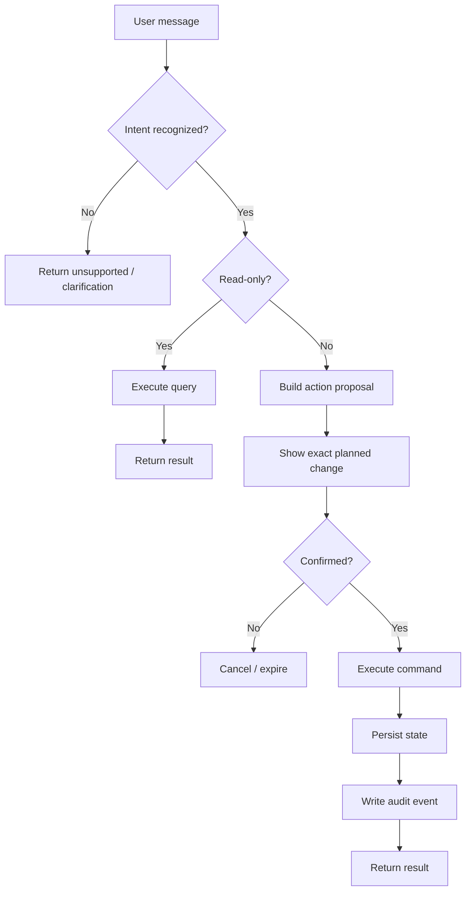
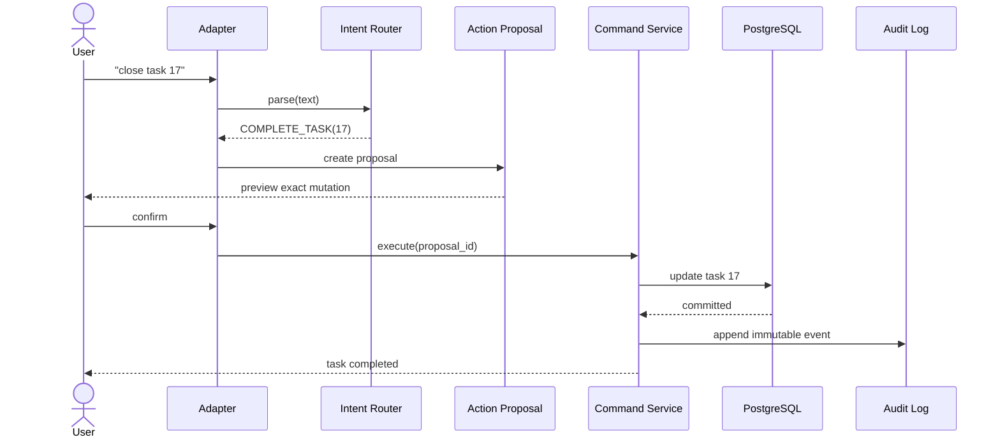
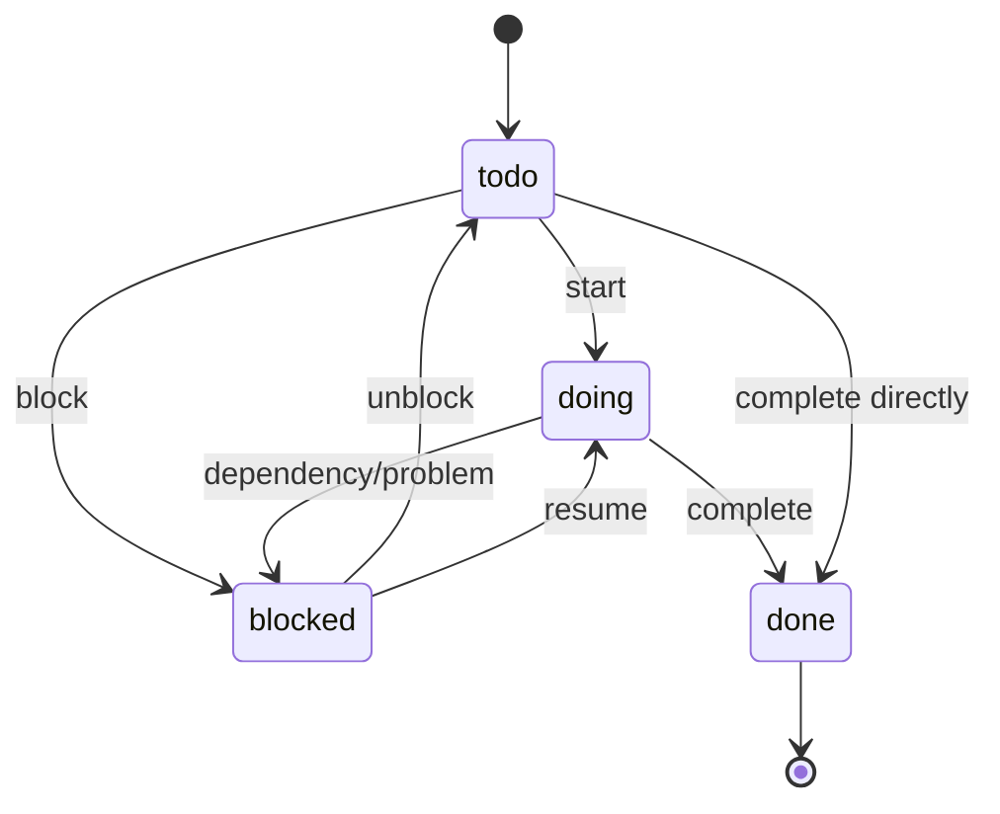
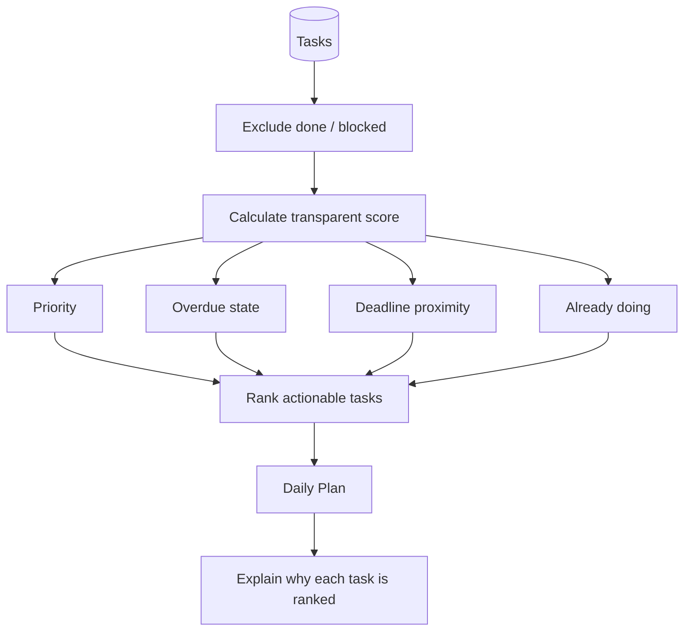
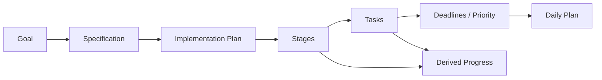

# DevWork diagrams

This page turns the project into a compact system-analysis case study. The diagrams describe the public-safe architecture and domain model; they do not depend on private infrastructure.

## 1. System context

The key boundary is between understanding a request and receiving permission to mutate state.

## 2. Core ER model

## 3. Read vs write decision flow

## 4. Mutation sequence

## 5. Task lifecycle

## 6. Daily planner flow

## 7. Project execution model

## Interview talking points

These diagrams make it possible to discuss the project without hiding behind code:

- why `project_id` and `stage_id` are foreign keys;
- why a task may exist without a stage;
- why confirmation is a separate domain entity;
- how idempotent confirmation should behave;
- which state transitions are allowed;
- why the planner is deterministic before adding ML/LLM logic;
- where REST/Telegram/CLI adapters end and application logic begins.
