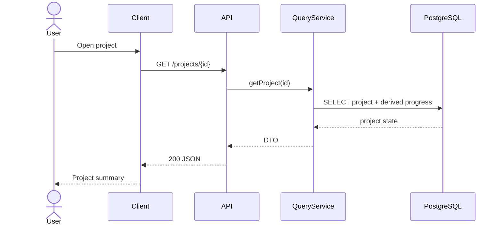
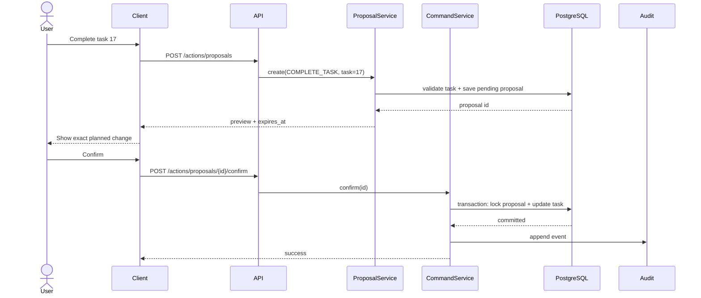
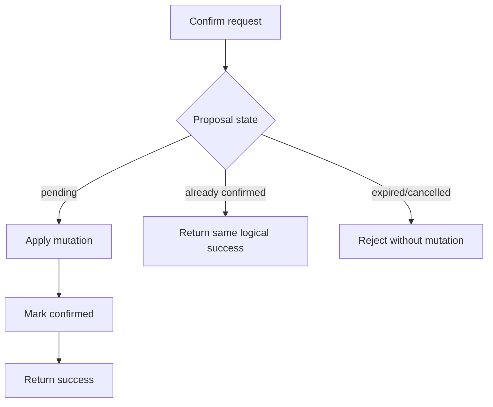
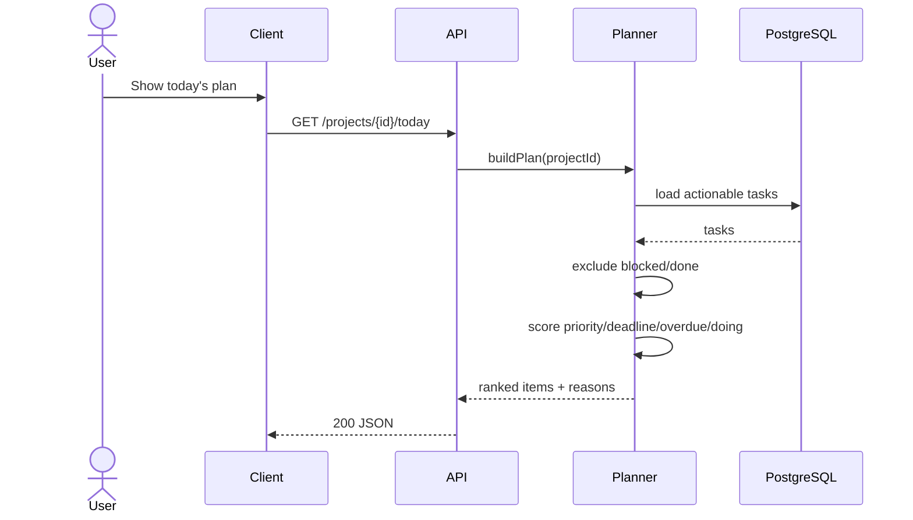

# DevWork integration scenarios

This document describes public-safe integration scenarios for the DevWork portfolio. It focuses on contracts, state transitions and failure handling rather than infrastructure details.

## Scenario 1 — Read project state

**Goal:** return the current project context without changing state.

Expected properties:

- operation is read-only;
- missing project returns `404`;
- response exposes derived state rather than asking the client to reconstruct business rules;
- no audit mutation event is created.

## Scenario 2 — Complete a task through confirmation

**Goal:** change a task only after the user sees and confirms the exact proposed mutation.

Expected properties:

- proposal creation has no task side effect;
- confirmation applies the stored proposal, not arbitrary new client payload;
- expired/stale proposal fails closed;
- repeated confirmation is idempotent;
- mutation and audit event belong to one logical operation.

## Scenario 3 — Duplicate confirmation

A client may retry after a timeout even though the first request succeeded.

The important requirement is not "never receive duplicates". The requirement is that duplicate delivery must not duplicate the business effect.

## Scenario 4 — Daily plan generation

The planner is deterministic in the first version so its result can be explained and tested.

## Scenario 5 — Concurrent stale action

Two clients may act on the same task state.

Example:

1. client A creates a proposal to complete task 17;
2. client B completes task 17 through another valid action;
3. client A confirms its old proposal.

Expected behaviour:

- confirmation re-validates the domain state;
- if the proposal no longer represents a valid transition, return `409 Conflict`;
- do not silently apply an outdated operation;
- record only the mutation that actually changes state.

## Integration questions an interviewer can ask

- Why separate proposal creation from confirmation?
- Where should idempotency be enforced?
- What makes a stale proposal different from an invalid JSON request?
- Why use `409` for an invalid current-state transition?
- What should happen if the database commit succeeds but the client times out?
- Which operations need transactions?
- Why should clients not own business-rule reconstruction?
