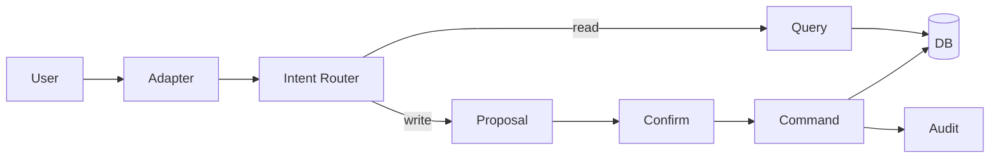

# DevWork interview guide

A compact route for explaining the project without reading the repository file-by-file.

## 30-second version

DevWork is a project/work automation system where the project goal, specification, implementation stages, tasks and daily plan share one domain model. I used it to practise a full system-analysis trail: requirements, use cases, business rules, ERD, SQL, REST/OpenAPI, state/sequence diagrams, tests and traceability. The key safety rule is that understanding a natural-language mutation is not permission to execute it: the system first creates an exact proposal and changes state only after explicit confirmation.

## 2-minute architecture explanation

1. **Adapters** receive Telegram/CLI/future web input.
2. **Intent Router** maps supported wording to known application intents.
3. Read-only intents go to a **Query Service**.
4. Mutations first create an **Action Proposal**.
5. Explicit confirmation sends the stored proposal to the **Command Service**.
6. The command re-validates current state, changes storage and records an audit event.
7. The daily planner reads authoritative task state and returns an explainable ranking.

## Questions I should be ready to answer

### Why PostgreSQL / relational data?

Projects, stages, tasks and proposals have clear relationships and integrity rules. Foreign keys and constraints make those relationships explicit, while SQL makes cross-entity queries easy to inspect.

### Why is `project_id` a foreign key?

It stores the stable identity of the related project. A project name can change or be duplicated; the ID is the relation.

### Why confirmation as a separate entity?

Because a chat message may be ambiguous or retried. A stored proposal binds confirmation to one exact operation and gives the system a place to model expiry, stale state and idempotency.

### Why `409 Conflict` for a stale proposal?

The request can be syntactically correct and refer to an existing entity, but it conflicts with the entity's current state. The client should rebuild the proposal from fresh state.

### Why not let an LLM write directly to the database?

Natural-language interpretation is probabilistic. The application uses deterministic domain commands as the authority over state; an AI layer can explain or suggest but does not bypass business rules and confirmation.

### What would I improve next?

Persistent repositories/migrations, fuller audit storage, authentication/authorization, recurring work, calendar constraints and integration tests around the HTTP adapter.

## Good files to open during an interview

- `README.md` — overview;
- `DIAGRAMS.md` — ERD, sequence and state diagrams;
- `REQUIREMENTS.md` — requirements and acceptance criteria;
- `API_EXAMPLES.md` / `openapi.yaml` — concrete API discussion;
- `SQL_EXAMPLES.md` — relational reasoning;
- `CHANGE_REQUEST_EXAMPLE.md` — change-impact analysis;
- `TEST_CASES.md` / `TRACEABILITY.md` — verification trail.
