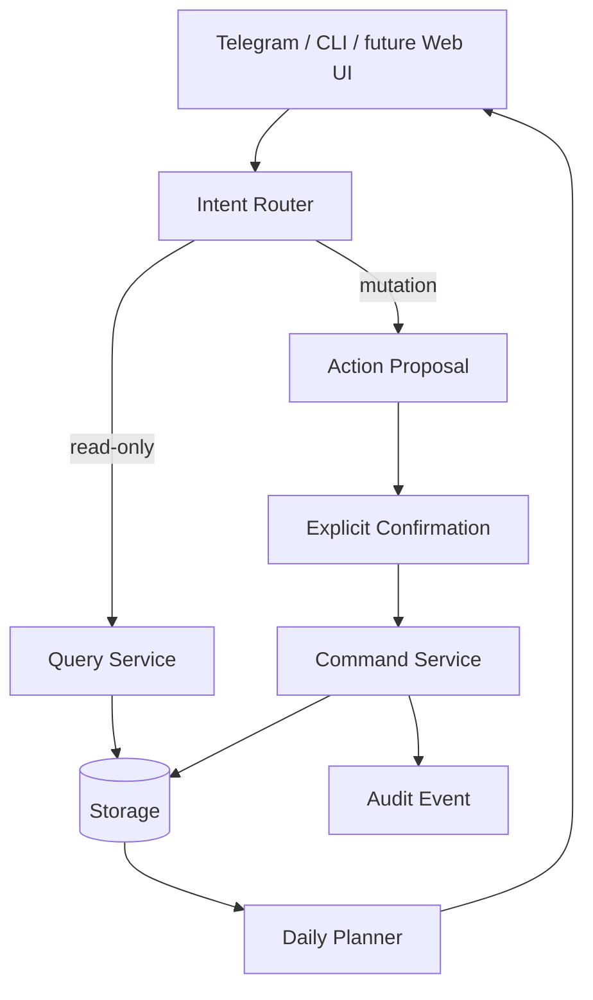
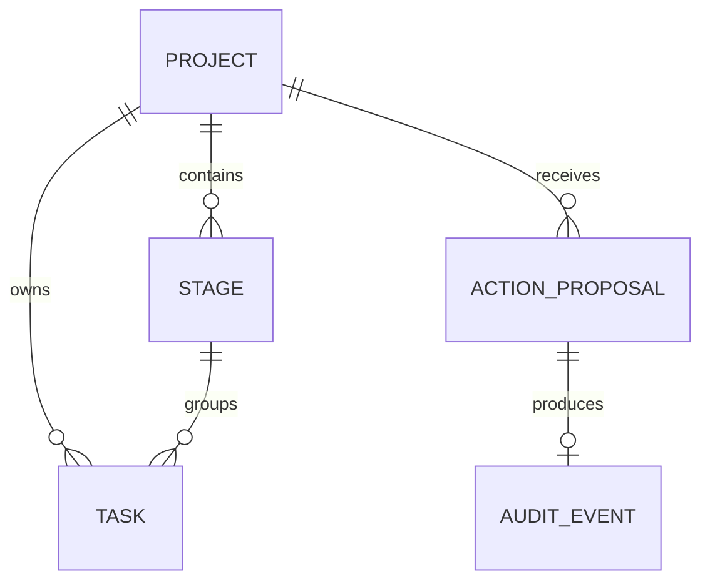

# DevWork

[](https://github.com/blsoo/devwork-system-analysis/actions/workflows/tests.yml)

**System analysis · REST/OpenAPI · SQL/PostgreSQL · Workflow automation · Python**

DevWork is a project/work automation assistant built around one principle: **project knowledge and project execution should live in the same model**.

Instead of keeping the goal in notes, the technical specification in a document, implementation stages in a spreadsheet and daily tasks in a messenger, DevWork connects them:

`Project goal -> specification -> implementation stages -> tasks -> deadlines -> daily plan`

The chat layer sits on top of that structure rather than replacing it.

## Analyst trail

This portfolio case is intentionally documented as a chain from requirement to verification:

```text
Requirements
    -> Use cases
    -> Business rules
    -> Domain / data model
    -> Integration scenarios
    -> REST / OpenAPI
    -> SQL / implementation
    -> Test cases
    -> Traceability
```

| Artifact | What it shows |
|---|---|
| [`REQUIREMENTS.md`](REQUIREMENTS.md) | functional/non-functional requirements + acceptance criteria |
| [`USE_CASES.md`](USE_CASES.md) | main and alternative system flows |
| [`CHANGE_REQUEST_EXAMPLE.md`](CHANGE_REQUEST_EXAMPLE.md) | vague product request -> clarification -> model/API/test impact |
| [`BUSINESS_RULES.md`](BUSINESS_RULES.md) | explicit domain rules and invariants |
| [`ARCHITECTURE.md`](ARCHITECTURE.md) | application boundaries and AI/write-safety boundary |
| [`DIAGRAMS.md`](DIAGRAMS.md) | system context, ERD, sequence, state machine and process flows |
| [`DATA_MODEL.md`](DATA_MODEL.md) | Project → Stage → Task model and derived views |
| [`INTEGRATION_SCENARIOS.md`](INTEGRATION_SCENARIOS.md) | reads, mutations, retries, stale state and concurrency |
| [`API_CONTRACT.md`](API_CONTRACT.md) | readable REST contract and error model |
| [`openapi.yaml`](openapi.yaml) | OpenAPI 3.1 contract draft |
| [`SQL_EXAMPLES.md`](SQL_EXAMPLES.md) | practical SQL over the domain model |
| [`TEST_CASES.md`](TEST_CASES.md) | black-box/system-level verification cases |
| [`TRACEABILITY.md`](TRACEABILITY.md) | requirement → interface → verification mapping |
| [`DECISIONS.md`](DECISIONS.md) | ADR-style design decisions and trade-offs |
| [`DEMO.md`](DEMO.md) | five-minute interview walkthrough |

## Core architecture



The key boundary is between **understanding a request** and **receiving permission to change real state**.

## Core ER model



The foreign keys carry relationships; queries and `JOIN`s use those relationships to read connected data.

## What this demonstrates

- requirements decomposition and acceptance criteria;
- clarification of ambiguous product requests;
- change-impact analysis across data, API and tests;
- domain modelling and PK/FK relationships;
- REST/API contract design;
- OpenAPI documentation;
- SQL reading and relational reasoning;
- sequence/state/process modelling;
- idempotency and retry-safe operations;
- stale-state and concurrency reasoning;
- confirmation-gated mutations;
- deterministic, explainable planning;
- traceability from requirement to verification;
- adapter/application separation.

## Executable prototype

- [`prototype/devwork_core.py`](prototype/devwork_core.py) — dependency-free application-core prototype;
- [`prototype/test_devwork_core.py`](prototype/test_devwork_core.py) — behaviour tests;
- [`prototype/schema.sql`](prototype/schema.sql) — PostgreSQL-oriented schema draft;
- [GitHub Actions](.github/workflows/tests.yml) — compilation + tests on every push/PR.

Run locally:

```bash
cd prototype
python -m unittest -v test_devwork_core.py
```

## Interview entry points

A reviewer can pick almost any layer and walk through it:

1. Start from `FR-05 Explicit confirmation` in requirements.
2. Follow `UC-02` in use cases.
3. Inspect the mutation sequence in diagrams/integration scenarios.
4. Read the confirmation endpoint in the API/OpenAPI contract.
5. Check the proposal and task tables in the SQL schema.
6. Verify behaviour in `TC-04 / TC-05` and the Python unit tests.

Or start from the recurring-task change request and explain why identity, history, timezone, retries and scheduler idempotency must be clarified before implementation.

That is the main point of the repository: **the system can be explained from requirement to behaviour, not only from code**.

## Related portfolio case

- [BullADM — safe operational automation](https://github.com/blsoo/bulladm-ops-automation)

## Current scope

The prototype is deliberately small and public-safe. It is not presented as production-ready and contains no credentials, external service keys or private production data.

Next implementation steps are persistent repository adapters/migrations, a thin Telegram adapter, fuller audit persistence, recurring work and calendar constraints.
