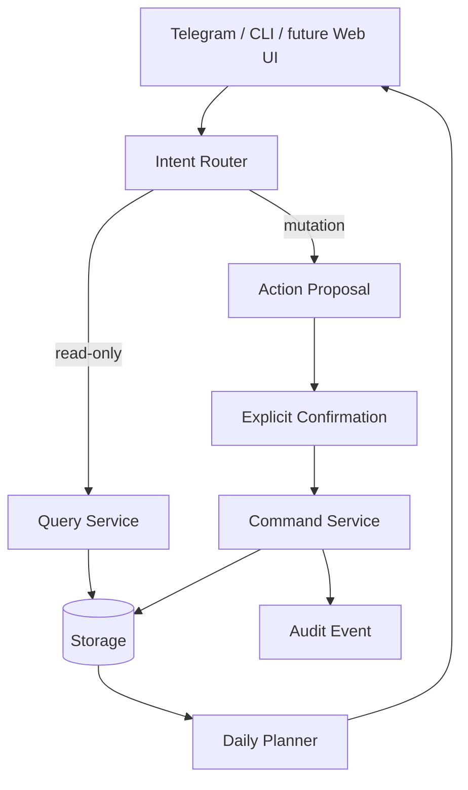

# DevWork

DevWork is a project/work automation assistant built around one principle: **project knowledge and project execution should live in the same model**.

Instead of keeping the goal in notes, the technical specification in a document, implementation stages in a spreadsheet and daily tasks in a messenger, DevWork connects them:

`Project goal -> specification -> implementation stages -> tasks -> deadlines -> daily plan`

The chat layer sits on top of that structure rather than replacing it.

## System-analysis package

This portfolio case is intentionally documented as a chain from requirement to verification:

`Requirements -> Use cases -> Business rules -> Domain model -> Integrations/API -> Implementation -> Test cases -> Traceability`

- [`REQUIREMENTS.md`](REQUIREMENTS.md) — functional/non-functional requirements and acceptance criteria.
- [`USE_CASES.md`](USE_CASES.md) — read, mutation, idempotency, planning and ambiguous-input scenarios.
- [`BUSINESS_RULES.md`](BUSINESS_RULES.md) — explicit domain rules and invariants instead of hidden handler logic.
- [`DIAGRAMS.md`](DIAGRAMS.md) — system context, ERD, sequence, state machine and process flows.
- [`DATA_MODEL.md`](DATA_MODEL.md) — project, stage, task and derived-view model.
- [`INTEGRATION_SCENARIOS.md`](INTEGRATION_SCENARIOS.md) — read/write sequences, retries, stale state and concurrency scenarios.
- [`API_CONTRACT.md`](API_CONTRACT.md) — readable REST contract and error model.
- [`openapi.yaml`](openapi.yaml) — OpenAPI 3.1 contract draft.
- [`SQL_EXAMPLES.md`](SQL_EXAMPLES.md) — practical SQL over the public domain model.
- [`TEST_CASES.md`](TEST_CASES.md) — black-box/system-level verification cases.
- [`TRACEABILITY.md`](TRACEABILITY.md) — requirement -> use case -> interface -> verification mapping.
- [`DECISIONS.md`](DECISIONS.md) — design decisions and trade-offs.
- [`DEMO.md`](DEMO.md) — five-minute recruiter/interview demo.

## What this demonstrates

This case study focuses on engineering problems that are common in real business automation:

- translating free-form user requests into deterministic application intents;
- separating read-only queries from data-changing actions;
- confirmation-gating mutations;
- modelling project state and progress;
- generating a daily plan from deadlines and priorities;
- keeping business rules outside the Telegram/UI layer;
- designing an AI boundary that does not give an LLM uncontrolled write access;
- connecting requirements to API behaviour and test evidence;
- reasoning about retries, idempotency, stale state and concurrent changes;
- reading and explaining SQL against a relational data model.

## Core architecture

The important boundary is between **understanding a request** and **changing real state**.

## Executable material

- [`prototype/devwork_core.py`](prototype/devwork_core.py) — dependency-free executable prototype.
- [`prototype/test_devwork_core.py`](prototype/test_devwork_core.py) — behaviour tests.
- [`prototype/schema.sql`](prototype/schema.sql) — PostgreSQL-oriented schema draft.

## Current scope

The prototype is deliberately small. It is not presented as production-ready and does not contain Telegram credentials, external APIs or persistent production data.

Its purpose is to make the architecture executable and reviewable before infrastructure is added.

## Next implementation steps

1. Move storage behind a repository interface.
2. Add SQLite/PostgreSQL persistence and migrations.
3. Add Telegram adapter without putting business rules in handlers.
4. Add audit events for every mutation.
5. Add recurring tasks and calendar constraints.
6. Add an optional conversational layer that receives read-only project context and returns suggestions, while deterministic application functions remain authoritative.
